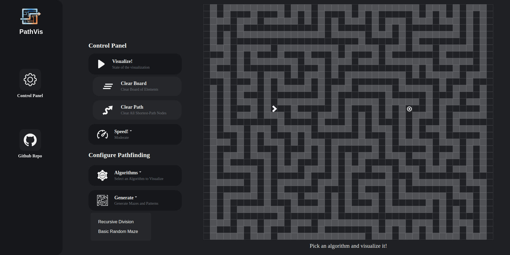
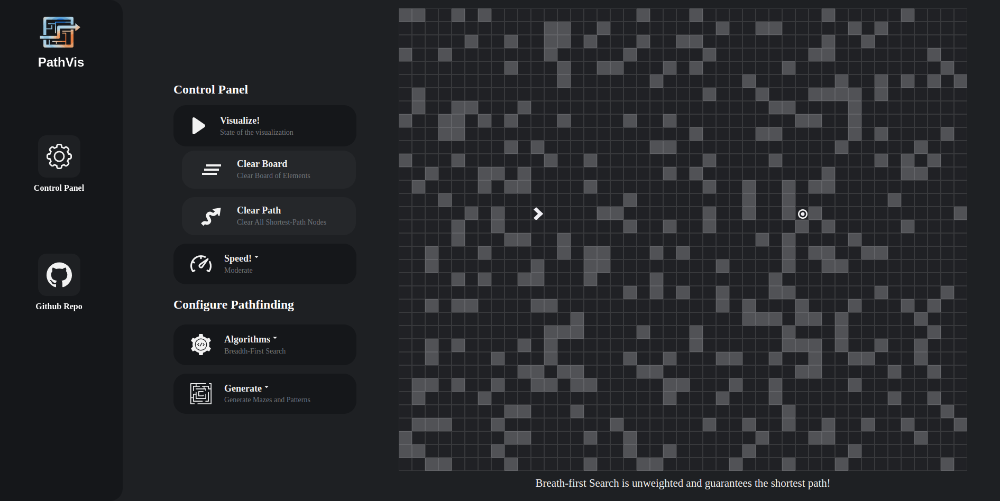

# Pathfinding-Visualizer

## Live Demo
- The website is hosted on <a class="font-weight-bolder" href="https://adamamirah.github.io/Pathfinding-Visualizer/">PathFinding Visualizer</a>. Feel free to use it.

## Technologies

1) React.js
2) TypeScript
3) Chakra UI
4) Framer Motion
   
## Scope of Functionalities
- To demonstrate the search algorithms in a way that could be visualized.

## Screenshots

https://github.com/AdamAmirah/Pathfinding-Visualizer/assets/55178727/05a29022-9e08-4690-9f3f-4942f4571453

## Acknowledgements
- This website is a clone of  <a class="font-weight-bolder" href="https://github.com/bendatsko/PathVis">PathVis</a> 
